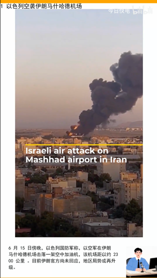
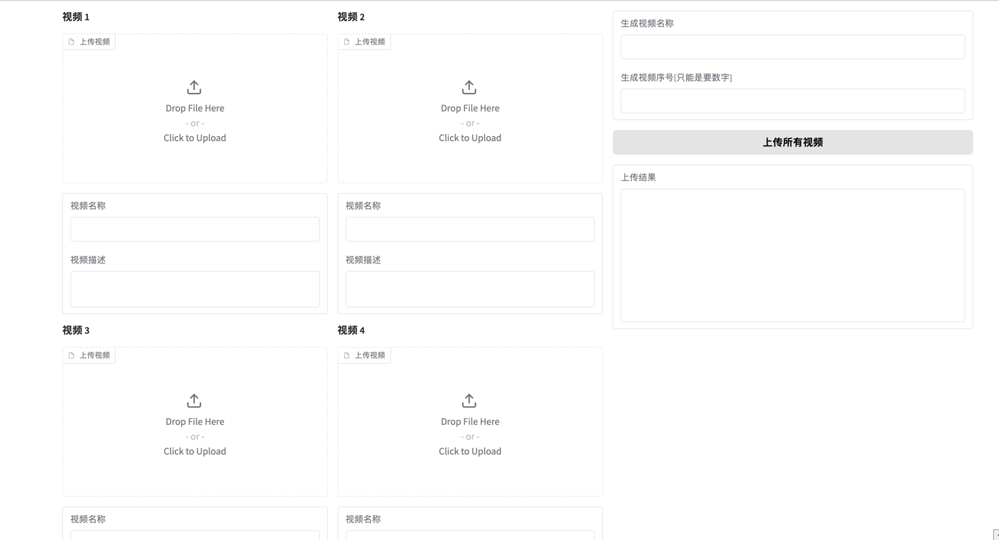

# 1. 技术方案

使用gradio作为用户接口的框架，让用户上传若干视频，将新闻的文字，生成音频，最终组合为一个音频

# 2. 新闻来源

- [x] 中国日报（chinadaily）
- [x] 英国广播公司（BBC）
- [x] 中东半岛新闻 https://www.aljazeera.com/

# 3. 使用

在ubuntu 22.04 中，使用conda创建一个python3.11的环境，安装依赖包，然后运行crawl_news.py和vedio_generator.py。

> 要先使用python crawl_news.py，下载好的数据，再调用video_generator.py生成视频。

```shell
nohup python index.py 2>&1 & 
```

# 4. 效果

生成的视频截图


操作界面的截图


# 5. 附件

爬取的数据样例：

```json
[
  {
    "video": "news_p/20250616/alj_up/2_以色列空袭伊朗马什哈德机场.mp4",
    "audio": "news_p/20250616/alj_up/2_以色列空袭伊朗马什哈德机场.mp3",
    "title": "以色列空袭伊朗马什哈德机场",
    "summary": "6 月 15 日傍晚，以色列国防军称，以空军在伊朗马什哈德机场击落一架空中加油机，该机场距以约 2300 公里 。目前伊朗官方尚未回应，地区局势或再升级。",
    "source": "alj_up",
    "show": true
  },
  {
    "video": "news_p/20250616/alj_up/2_特朗普生日盛大军事游行.mp4",
    "audio": "news_p/20250616/alj_up/2_特朗普生日盛大军事游行.mp3",
    "title": "特朗普生日盛大军事游行",
    "summary": "特朗普生日之际，迎来期盼多年的盛大军事游行。坦克与部队亮相华盛顿特区，此次游行恰逢陆军成立 250 周年纪念，场面壮观。",
    "source": "alj_up",
    "show": true
  },
  {
    "video": "news_p/20250616/alj_up/2_以色列总理内塔尼亚胡视察伊朗遭袭地点.mp4",
    "audio": "news_p/20250616/alj_up/2_以色列总理内塔尼亚胡视察伊朗遭袭地点.mp3",
    "title": "以色列总理内塔尼亚胡视察伊朗遭袭地点",
    "summary": "此次视察举动引发外界对地区局势走向及以伊关系动态的密切关注。在此期间，因部分人员仍被困于废墟之下，救援行动正在紧张开展。救援力量全力投入，争分夺秒拯救生命，局势备受关注。",
    "source": "alj_up",
    "show": true
  }
]
```

# 6. update log

## 6.1. crawl video from aljazeera
```python
import requests
import re
import os

# ===== Step 1: 获取网页 HTML =====
url = "https://example.com/video-page"  # 目标网页
headers = {
    "User-Agent": "Mozilla/5.0"
}

resp = requests.get(url, headers=headers)
html = resp.text

# ===== Step 2: 提取 .m3u8 链接 =====
# 可能嵌在 <script>、source 标签中，也可能是 JS 变量
m3u8_urls = re.findall(r'https?://[^"\']+\.m3u8', html)

if not m3u8_urls:
    print("❌ 未找到 .m3u8 视频链接")
    exit()

m3u8_url = m3u8_urls[0]  # 假设第一个为主链接
print(f"找到视频链接：{m3u8_url}")

# ===== Step 3: 下载 .m3u8 文件 =====
m3u8_resp = requests.get(m3u8_url, headers=headers)
m3u8_content = m3u8_resp.text

# ===== Step 4: 解析 ts 分片列表 =====
base_url = m3u8_url.rsplit("/", 1)[0]
ts_list = [line.strip() for line in m3u8_content.splitlines() if line and not line.startswith("#")]

# 创建临时文件夹
os.makedirs("ts_files", exist_ok=True)

# ===== Step 5: 下载 ts 分片 =====
for i, ts_file in enumerate(ts_list):
    ts_url = ts_file if ts_file.startswith("http") else f"{base_url}/{ts_file}"
    ts_data = requests.get(ts_url, headers=headers).content
    ts_path = f"ts_files/{i:04d}.ts"
    with open(ts_path, "wb") as f:
        f.write(ts_data)
    print(f"已下载分片 {i + 1}/{len(ts_list)}")

# ===== Step 6: 合并为 TS 文件 =====
with open("output.ts", "wb") as outfile:
    for i in range(len(ts_list)):
        with open(f"ts_files/{i:04d}.ts", "rb") as infile:
            outfile.write(infile.read())

# 可选：转为 MP4
os.system("ffmpeg -i output.ts -c copy output.mp4")

print("✅ 视频下载完成")

```

### 6.1.1. analyse video by AI model
可以使用PaddleOCR来分析视频中的文字，

> PaddleOCR如果使用GP U，一般是多大显存的GPU


| 模型类型                      | 版本                                | 所需显存            | 说明                                    |
| ------------------------- | --------------------------------- | --------------- | ------------------------------------- |
| **轻量级模型**                 | PP-OCRv3 / PP-OCRv4（mobile 模型）    | **512MB～1.5GB** | 推荐用于部署，适合嵌入式设备、轻量显卡（如 GTX 1050、MX250） |
| **通用高精度模型**               | PP-OCRv4（server 模型）               | **2～4GB**       | 精度更高，适合服务器或中等显卡（如 GTX 1660、RTX 3060）  |
| **中英文多语言模型**              | multilingual（例如 ch, en, fr, etc.） | **2～6GB**       | 语言支持越多模型越大                            |
| **文档/表格识别（PPOCR-Layout）** | 布局分析 + OCR                        | **>4GB**        | 会加载多个模型，推荐 6GB+                       |

- GTX 1050Ti（4GB）：运行 ch_PP-OCRv3_mobile 没有压力，视频帧抽取配合 OpenCV 达 10FPS。


### 6.1.2. generate news video


## multiple audio segments
已完成，增加了进度条，但是以下两种方式的效率，两步写，效率还高一些：
- 两步写：先写入一个整合的视频，再加载到内存，对这个视频写入进度条，耗时366.86 秒  
- 一步写：整合好的视频保持在内存中，写入进度条，耗时：399秒